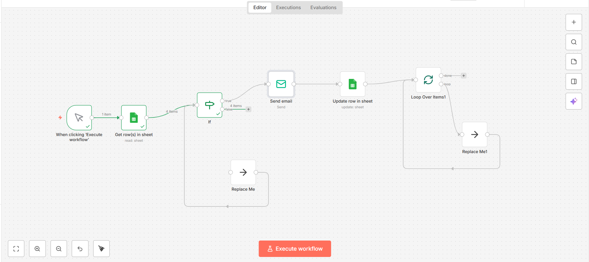

# Automated HR Email System using n8n + Google Sheets + SMTP

This project demonstrates a real-world workflow automation built using n8n that sends personalized emails to candidates automatically using data from Google Sheets.

The workflow ensures that emails are sent only once by tracking the status of each candidate in the sheet.

---

## 🚀 Features

- Reads candidate data from Google Sheets
- Processes data row by row using Split In Batches
- Checks email status to prevent duplicate emails
- Sends role-based personalized emails
- Updates sheet after sending email
- Uses Gmail SMTP (no n8n branding)

---

## 🛠️ Tech Stack

- n8n (Workflow Automation)
- Google Sheets (Data Source)
- Gmail SMTP (Email Service)

---

## 📊 Google Sheet Format

| Name | Email | Role | Status |
|------|-------|------|--------|
| Amit Sharma | amitdemo@gmail.com | Python Developer |  |
| Neha Patil | nehademo@gmail.com | Angular Developer |  |

---

## ⚙️ Workflow Logic

1. Read all rows from Google Sheet
2. Split rows into batches (1 by 1)
3. Check if `Status != SENT`
4. Send personalized email mentioning candidate role
5. Update the row status to `SENT`
6. Loop to the next row

---

## 📂 Repository Contents

- `workflow-sample.json` — Exported n8n workflow (with masked data)
- `google-sheet-demo.csv` — Sample sheet format
- `screenshots/` — Workflow and output images

---

## 💡 Use Case

This automation can be used by HR teams to send bulk personalized emails efficiently without sending duplicates.

---
## 📸 Project Screenshots

### n8n Workflow

### Google Sheet Data

---

## 👨‍💻 Author
Rohan Karhad
